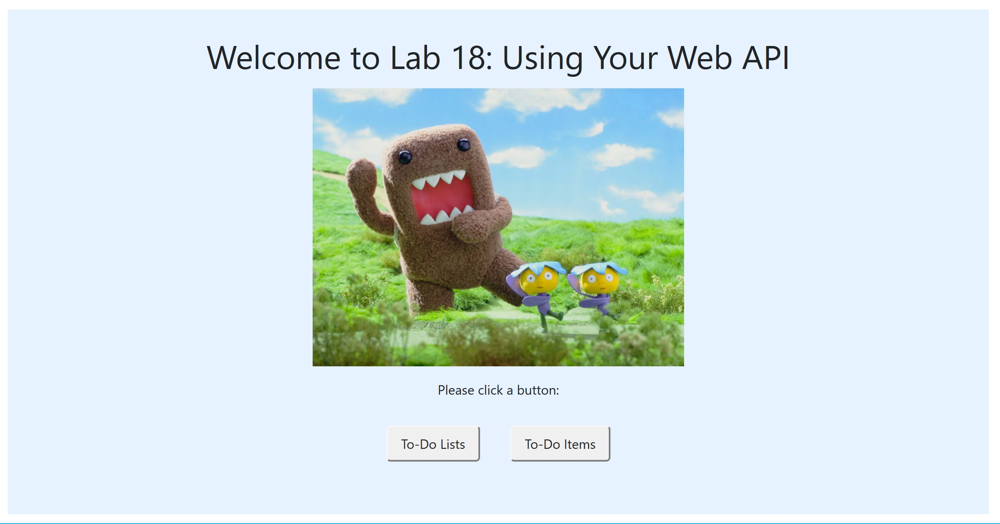
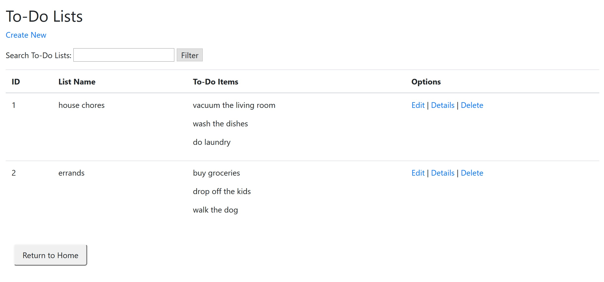
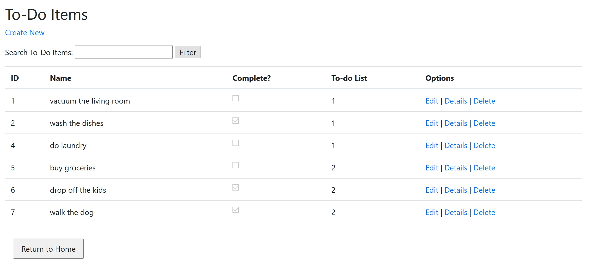

# Lab-18-Using-Your-API
CODE: Using Your API assignment for Code Fellows 401 C#/ASP.NET course

**Author**: Earl Jay Caoile  
**Version**: 1.0.0

## Overview
This MVC web app uses an external API (created in [lab 17](https://github.com/ecaoile/Lab-17-Web-APIs)) 
to demonstrate CRUD (create, read, update, delete) operations on an API using an web application.

## Getting Started
The following is required to run the program.
1. Visual Studio 2017 
2. The .NET desktop development workload enabled
3. ASP.NET MVC packages

## Example
  
 
  

## Happy path
- open home page
- click To-Do Lists page button
- view to-do lists and perform CRUD operations (create, edit, view details, delete)
- click button to return to home page
- click To-Do Items page button
- view to-do items and perform CRUD operations (create, edit, view details, delete)
- smile

## Architecture
This application is created using ASP.NET Core 2.1 Web Application  
*Languages*: C#, HTML, CSS  
*Type of Applicaiton*: MVC Web Application  

## Change Log
06-30-2018 9:00 PM - initial scaffolding  
06-30-2018 2:00 PM - full CRUD operations on to-do items  
07-01-2018 6:30 PM - fancy LINQ calls in view for index page (showing all to-do items
for all to-do lists properly sorted)  
07-01-2018 10:00 PM - full CRUD operations on to-do lists  
07-01-2018 11:00 PM - figured out how to delete to-do items along with a deleted to-do list  
07-01-2018 11:30 PM - CSS touches, home page  
07-01-2018 11:45 PM - website deployment  

